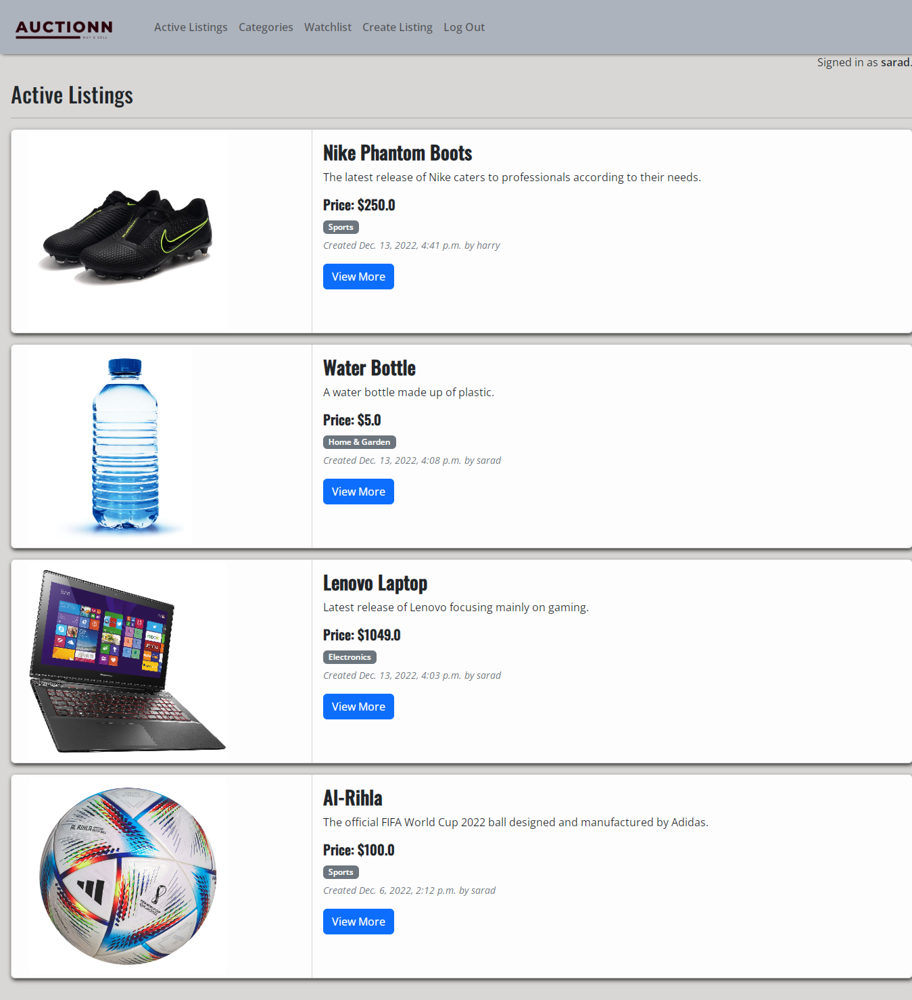
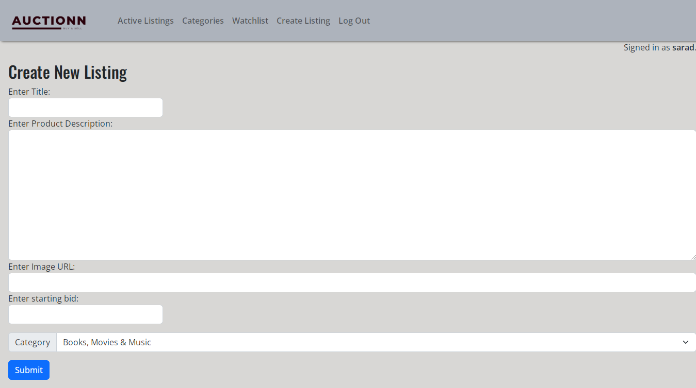
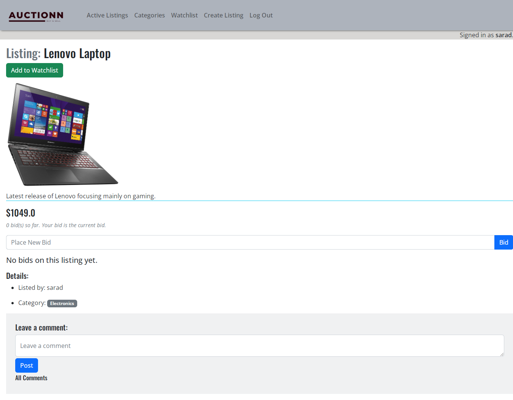
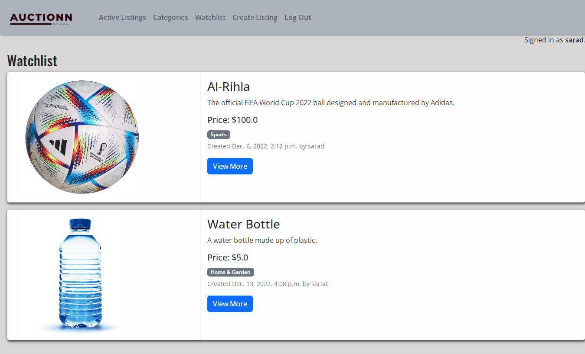
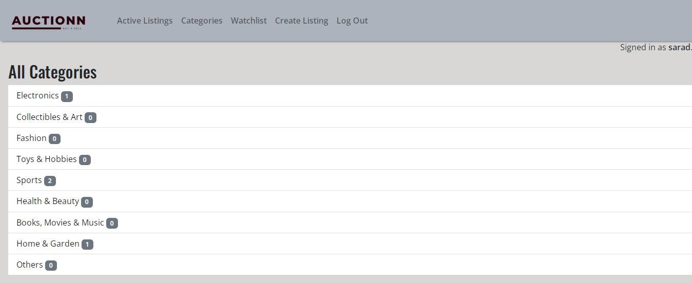

# Auctionn

This is my solution to the Project 2 of [CS50's Web Programming with Python and Javascript](https://cs50.harvard.edu/web/2020/)

## Overview

### Screenshot

### Links

- Live Site URL: ...

## My process

### Built with

- Python
- Django
- HTML
- CSS
- Bootstrap
- SQL

### Author

- LinkedIn - [Sarad Sapkota](https://www.linkedin.com/in/sarad-sapkota/)
- Twitter - [@SapkotaSarad](https://twitter.com/SapkotaSarad)
 
 
